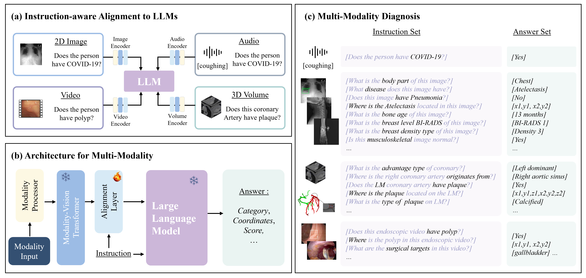

# MedViLaM

## News
We now provide a pretrained MedViLaM on Feb 5, 2024! 

## Online Demo
Click the image to have a try with MedViLaM around the chest DR images

<!-- Insert a pipeline of your algorithm here if got one -->
<div align="center">
    <a href="https://03b4c252cce4384a08.gradio.live"></a>
</div>


## Key Features

This repository provides the official implementation of MedViLaM

key feature bulletin points here
(1)We propose a vision-language model incorporating instruction tuning to enhance medical visual understanding in LLMs.
The proposed model support multi-task analysis of various medical images and has achieved satisfactory performance of generalization and interpretability.

(2) We've established a novel framework for developing pretraining datasets and benchmark intended for custom instruction tuning.
Our method deviates from the conventional system of pair-wise supervision (an image and its corresponding label), utilizing instead cross-task training supervision for each specimen, which amplifies the comprehension of correlations amongst tasks. 
We introduce a thorough benchmark for assessing the generalizability of large-scale foundation models when applied downstream to a variety of real-world clinical tasks. 

(3)State-of-the-art results on medical visual benchmarks, showcasing few-shot generalization ability.
Radiologist evaluation are also performed on the chest X-ray diagnoses generated by our model. 
## Links

- [Paper](https://arxiv.org/abs/2311.01092)
- [Model](https://huggingface.co/MedHK23/MedViLaM)
- [Dataset](https://huggingface.co/datasets/MedHK23/MedViLaM)


<!-- give a introduction of your project -->
## Details

 We have built a multimodal multitask model for DR data, aiming to solve all tasks in this field with one model, such as report generation, disease detection, disease question answering, and even segmentation. Without any fine-tuning, our model has achieved satisfactory results in report generation, disease detection and question answering.

<!-- Insert a pipeline of your algorithm here if got one -->
<div align="center">
    
</div>


## Dataset Links

We utilize 10 public and 6 private datasets for pre-training and provide the download via the following links:

Public dataset of DR: 
Chest Xray:
- [MIMIC-CXR](https://physionet.org/content/mimic-cxr/2.0.0/)
- [VinDR](https://www.kaggle.com/c/vinbigdata-chest-xray-abnormalities-detection/data)
- [ChestX-Det-Dataset](https://github.com/Deepwise-AILab/ChestX-Det-Dataset)
- [ChestX-ray14]( https://nihcc.app.box.com/v/ChestXray-NIHCC)
- [CheXpert]( https://stanfordmlgroup.github.io/competitions/chexpert/)
- [TBX11K](https://www.kaggle.com/datasets/vbookshelf/tbx11k-simplified)
- [object-CXR]( https://github.com/hlk-1135/object-CXR)
- [JSRT Database]( http://db.jsrt.or.jp/eng.php)
- [Shenzhen chest X-ray Set]( https://www.ncbi.nlm.nih.gov/pmc/articles/PMC4256233/)
- [Montgomery County chest X-ray Set]( https://www.ncbi.nlm.nih.gov/pmc/articles/PMC4256233/)

Others:
- [VinDR](https://vindr.ai/)
- [RSNA](https://www.kaggle.com/datasets/kmader/rsna-bone-age)
- [FracAtlas](https://figshare.com/articles/dataset/The_dataset/22363012)
- [GRAZPEDWRI-DX](https://figshare.com/articles/dataset/GRAZPEDWRI-DX/14825193)
- [PelviXNet ](https://figshare.com/articles/dataset/Pelvic_X-ray_images_for_PelviXNet_model/17185814)
- [ChestPelvisCSpineScans](https://www.kaggle.com/datasets/pardonndlovu/chestpelviscspinescans)
- [MURA](https://stanfordaimi.azurewebsites.net/datasets/3e00d84b-d86e-4fed-b2a4-bfe3effd661b)
- [Candid PTX](https://auckland.figshare.com/articles/dataset/CANDID-PTX/14173982)

Video:
- [CholecSeg8k](https://www.kaggle.com/datasets/newslab/cholecseg8k)
- [CholecTriplet](https://cholectriplet2021.grand-challenge.org/)
- [Cholecscopic](http://www.depeca.uah.es/colonoscopy_dataset/)
- [CVC-12k](https://polyp.grand-challenge.org/Databases/)
- [Hyper-Kvasir](https://datasets.simula.no/hyper-kvasir/)
- [KUMC](https://dataverse.harvard.edu/dataset.xhtml?persistentId=doi:10.7910/DVN/FCBUOR)
- [Kvasir-Capsule](https://datasets.simula.no/kvasir-capsule/)
- [LPPolypVideo](https://github.com/dashishi/LDPolypVideo-Benchmark)
- [Nerthus](https://datasets.simula.no/nerthus/)
- [PolypDiag](https://github.com/tianyu0207/weakly-polyp)
- [SUN-SEG](https://github.com/GewelsJI/VPS/blob/main/docs/DATA_PREPARATION.md)

Audio:
- [Coswara1](https://github.com/iiscleap/Coswara-Data)

Volume:
- [ImageCAS](https://github.com/XiaoweiXu/ImageCAS-A-Large-Scale-Dataset-and-Benchmark-for-Coronary-Artery-Segmentation-based-on-CT?tab=readme-ov-file)
- [ASOCA](https://asoca.grand-challenge.org/)

## Get Started

**Main Requirements**  

- python 3.7.4
- pytorch 1.8.1
- torchvision 0.9.1
- gradio 3.34.0


**Installation**
```bash
git clone https://github.com/MedHK23/MedViLaM.git
pip install -r requirements.txt
```


**Training**
```bash
### before training, please download the pretrained models and datasets and place them in their respective folders.
bash ./run_scripts/multi_tasks/train.sh
```


**Testing**
```bash
from demo_base import init_task, ask_answer
from PIL import Image

print('Initializing Chat')
init_task()
print('Initialization Finished')

instruction = 'describe this image'
image = Image.open('test.png').convert('RGB')
report = ask_answer(image, instruction)
```


## 🛡️ License

This project is under the Apache License. See [LICENSE](LICENSE.txt) for details.

## 🙏 Acknowledgement

A lot of code is modified from [OFA](https://github.com/OFA-Sys/OFA).

## 📝 Citation

If you find this repository useful, please consider citing this paper:
```
@misc{xu2023learning,
      title={MedViLaM: A multimodal large language model with advanced generalizability and explainability for radiography image analysis}, 
      author={Lijian Xu and Ziyu Ni and Xinglong Liu and Xiaosong Wang and Hongsheng Li and Shaoting Zhang},
      year={2023},
      eprint={2311.01092},
      archivePrefix={arXiv},
      primaryClass={cs.CV}
}
```

